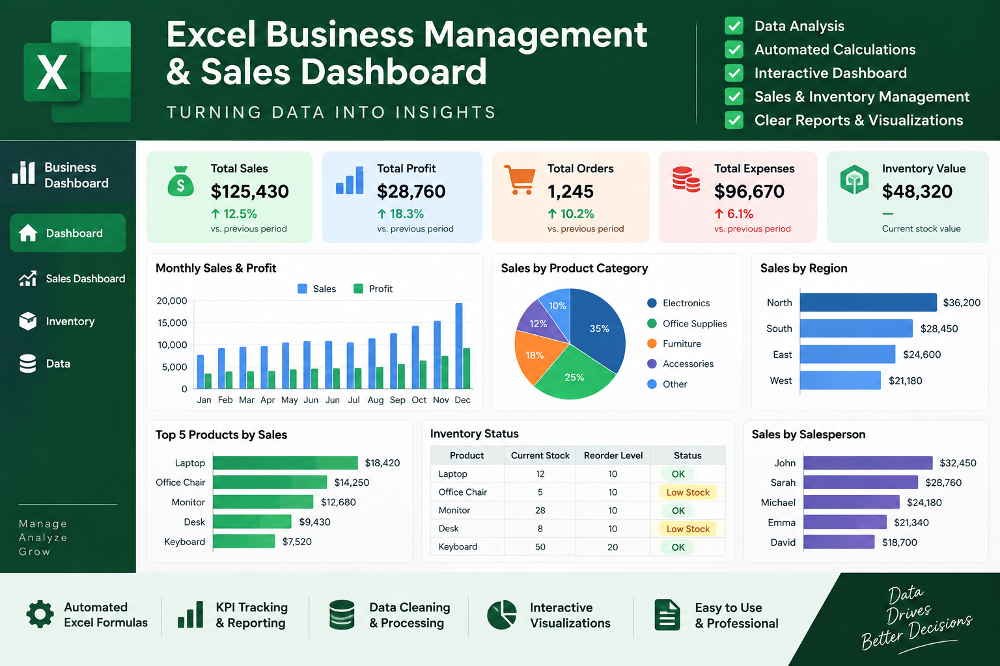

# Excel Business Sales Dashboard

Interactive Excel dashboard designed for business management, sales analysis, KPI tracking, inventory monitoring, and data visualization.

## Dashboard Preview

## Features

- Sales and revenue analysis
- KPI tracking and performance monitoring
- Inventory monitoring
- Interactive charts and visualizations
- Business management dashboard
- Clean and professional Excel reporting
- Data processing and analysis

## Skills Used

Microsoft Excel • Data Analysis • Data Processing • Data Visualization • Dashboard Design • Business Analytics

## About This Project

This project demonstrates my ability to transform business data into a clear and practical Excel dashboard. The dashboard helps users monitor key business metrics, analyze sales performance, track inventory, and make data-driven decisions.

## Freelance Services

I can create customized Excel solutions including:

- Interactive Excel dashboards
- Sales and business reports
- Data cleaning and processing
- KPI dashboards
- Automated Excel reports
- Charts and data visualization
