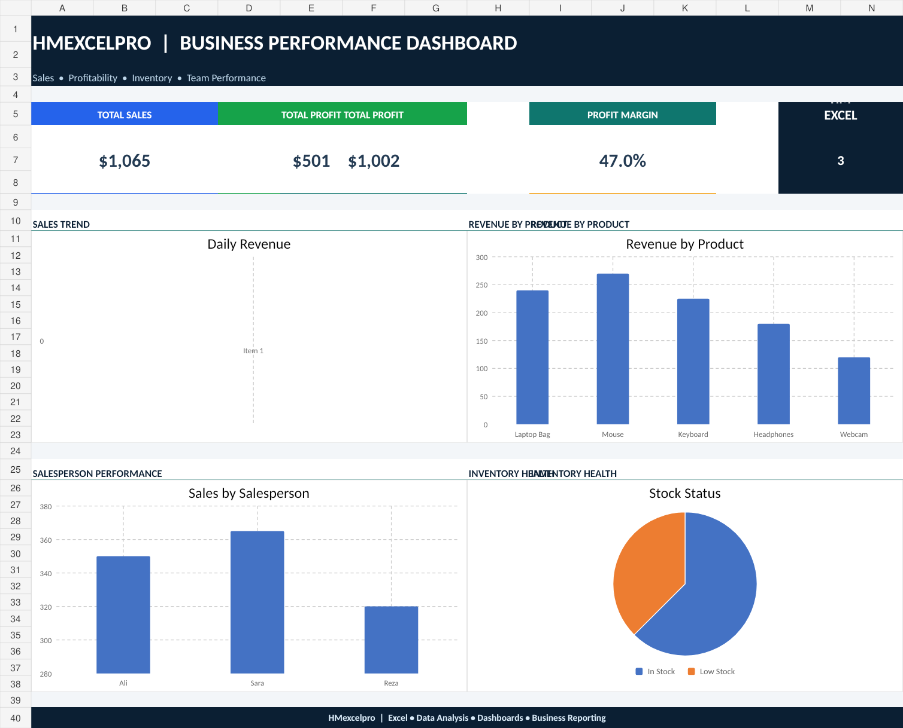

# Excel Business Performance Dashboard

A professional Excel dashboard designed to transform business data into clear, practical, and easy-to-understand management insights.

This project demonstrates how Microsoft Excel can be used for business performance analysis, KPI monitoring, sales reporting, profitability analysis, and inventory tracking.

---

## 📊 Dashboard Preview

---

## 🚀 Project Overview

The dashboard provides a centralized view of key business metrics and helps users monitor overall performance, analyze sales trends, evaluate profitability, compare product and salesperson performance, and track inventory status.

It is designed as a practical portfolio project demonstrating Excel-based data analysis and management reporting.

---

## ✨ Key Features

- Sales and revenue analysis
- Profitability tracking
- KPI monitoring
- Sales trend visualization
- Product performance analysis
- Salesperson performance analysis
- Inventory monitoring
- Low-stock indicators
- Management reporting
- Interactive charts and visualizations
- Clean and structured dashboard design

---

## 📈 Key KPIs

The dashboard provides management-level indicators including:

- Total Sales
- Total Profit
- Profit Margin
- Average Sales
- Transaction Count
- Sales Performance
- Product Performance
- Inventory Status

---

## 📁 Workbook Structure

The Excel workbook is organized to separate business data, analysis, and dashboard reporting.

It includes sections for:

- Business data
- Sales analysis
- Product performance
- Salesperson performance
- Inventory monitoring
- KPI reporting
- Executive dashboard

---

## 🌐 Available Languages

This project is available in two versions:

**English Version**  
`HMexcelpro_Business_Dashboard_EN.xlsx`

**Persian Version | نسخه فارسی**  
`HMexcelpro_Business_Dashboard_FA.xlsx`

The English version is intended for international portfolio use, while the Persian version provides a localized interface for Persian-speaking users.

---

## 🛠️ Skills Demonstrated

- Microsoft Excel
- Data Analysis
- Data Processing
- Data Visualization
- Dashboard Design
- KPI Reporting
- Business Reporting
- Business Analytics

---

## 💡 How to Use

1. Download the preferred Excel version.
2. Open the workbook in Microsoft Excel.
3. Review the underlying business data.
4. Navigate to the dashboard.
5. Use the dashboard to analyze KPIs, sales performance, profitability, and inventory status.

> This portfolio project uses demonstration data and is intended to showcase Excel dashboard and data analysis skills.

---

## 💼 Freelance Services

I create customized Excel solutions for business and reporting needs, including:

- Excel dashboards
- Sales and business reports
- KPI reporting
- Data cleaning and processing
- Data visualization
- Financial and management reporting
- Inventory reporting

---

## 👤 Author

**HMexcelpro**

Excel • Data Analysis • Data Visualization • Dashboard Design • Business Reporting

---

### English & Persian versions available | نسخه انگلیسی و فارسی موجود است
